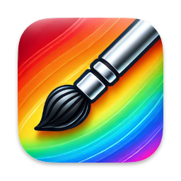
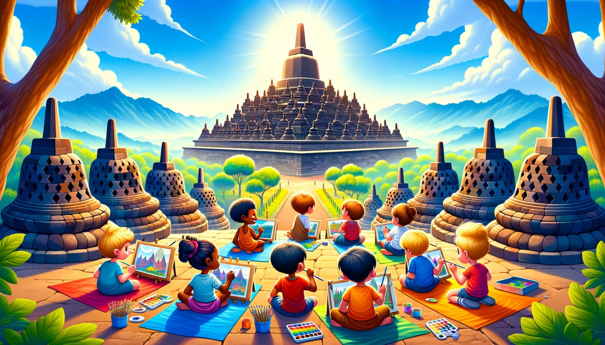
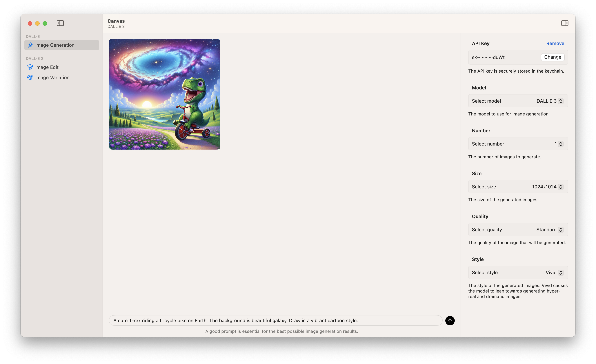

  

    
    <h1>Canvas - DALL·E Playground for the Mac</h1>
    <picture>
      <source media="(prefers-color-scheme: dark)" srcset="./assets/banner-night.jpg">
      
    </picture>
    

      
<em>Illustration of kids drawing in the Borobudur Temple, generated by DALL·E 3.</em>

    

  

## Prerequisites

- macOS 14.0 Sonoma or later.
- OpenAI API key (You can get it [here](https://platform.openai.com/api-keys)).

## Download

You can download the latest version of Canvas from the [releases page](https://github.com/kevinhermawan/Canvas/releases).

## Features

- Image Generation with DALL·E 3 & DALL·E 2.
- Image Editing (_currently only for DALL·E 2_).
- Image Variations (_currently only for DALL·E 2_).
- Copy, save, and share generated images.
- Simple and easy to use.
- Free and open source.
- Native.

And more...

## Screenshot

  <picture>
    <source media="(prefers-color-scheme: dark)" srcset="./assets/screenshot-dark.png">
    
  </picture>

## Acknowledgements

- [AppInfo by @kevinhermawan](https://github.com/kevinhermawan/AppInfo)
- [ChatField by @kevinhermawan](https://github.com/kevinhermawan/ChatField)
- [Defaults by @sindresorhus](https://github.com/sindresorhus/Defaults)
- [KeychainAccess by @kishikawakatsumi](https://github.com/kishikawakatsumi/KeychainAccess)
- [Nuke by @kean](https://github.com/kean/Nuke)
- [OpenAI by @MacPaw](https://github.com/MacPaw/OpenAI)
- [Sparkle by @sparkle-project](https://github.com/sparkle-project/Sparkle)
- [ViewCondition by @kevinhermawan](https://github.com/kevinhermawan/ViewCondition)
- [ViewState by @kevinhermawan](https://github.com/kevinhermawan/ViewState)

## License

This repository is available under the [Apache License 2.0](./LICENSE), with a few additional restrictions.
